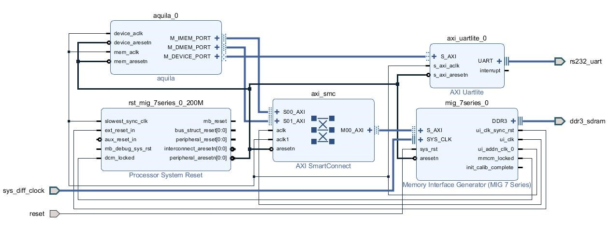

# The Aquila SoC
Aquila is an open-source 32-bit RISC-V RV32IMA compliant processor core for Xilinx FPGAs, released under the BSD-3-Clause Licence. The processor core is encapsulated as a reusable IP for Xilinx Vivado EDA tools. You can use the Vivado Block Diagram Editor to integrate Aquila with other IPs in Vivado IP catalog to create an application-specific processor SoC.

Currently, the microarchitecture of Aquila implements the classical five-stage pipeline RISC architecture with in-order execution. Since Aquila is intended for HW-SW codesigned intelligent systems, heavy-lifting tasks will be handled by HW accelerators. Therefore, we are not in a hurry to move over to a superscalar architecture. System-level stability and full-feature OS support will be the focus of our development for now.

Aquila is designed for intelligent system SoCs for Xilinx FPGAs. The default behavior of the Aquila SoC, when configured into a Xilinx FPGA, is to execute a boot code stored in ROM to load a binary executable from the Host PC through the UART connection. We will provide different boot ROMs in the future to boot the system from other devices (such as the SD card) to facilitate the design of a turn-key system.

# Specification
The current version of Aquila is 1.0, with the following specification:

- RV32IMA ISA-compliant.
- CSRs & related instructions for M mode.
- Embeded 64KB tightly-coupled on-chip memory (TCM).
- L1 data and instruction caches.
- CLINT for standard timer interrupts.
- The RTL model written in Verilog.
- SD card I/O support (not in the released model yet, but coming soon).
- Multi-core support with coherent data cache controller (not in the released RTL model yet).

The following features are under development and should be ready in 2021:

- MMU.
- Full M, S, U modes support in CSRs.

# Performance
On Xilinx KC-705, we synthesize the Aquila SoC @ 100MHz. Its Dhrystone number is 0.71 DMIPS/MHz. This number can go up to 0.78 DMIPS/MHz if we fine-tune the Writeback stage for optimized TCM execution.

# Synthesis of Aquila
Aquila is developed and tested using Xilinx KC-705 development platform. Implementing an Aquila SoC would be fairly straightforward if you are familiar with the GUI IDE of Vivado. If you have to modify the boot ROM memory file, its source code and the build script is under sw/uartboot/. Please refer to the User’s Guide for more details about the Aquila SoC.

We will provide Vivado workspace for other less expensive platforms, such as the Arty, soon. However, KC-705 will most likely be the main development platform for Aquila SoCs.

# User's Guide
A simple user's guide to Aquila is available [here](docs/aquila_manual.pdf).

# Creation of the complete Vivado workspaces of Aquila
To create the complete Vivado workspace for the Aquila SoC, you can use the hw/build.tcl script and follow the instructions [here](hw/readme.md).

We also have the tar files for previous versions of Aquila in the archive directory.
- Aquila version [0.9 preview](archive/aquila_soc_0.9_preview.tgz). Tested with Vivado 2018.2 on Xilinx KC705.

# Acknowledgment
This work is partly funded by the Chip Implementation Center (CIC), National Applied Research Laboratories, Taiwan, ROC.

# Contact Info
Embedded Intelligent Systems Lab (EISL)  
Department of Computer Science  
National Chiao Tung University  
Hsinchu, Taiwan

eisl.nctu-at-gmail
